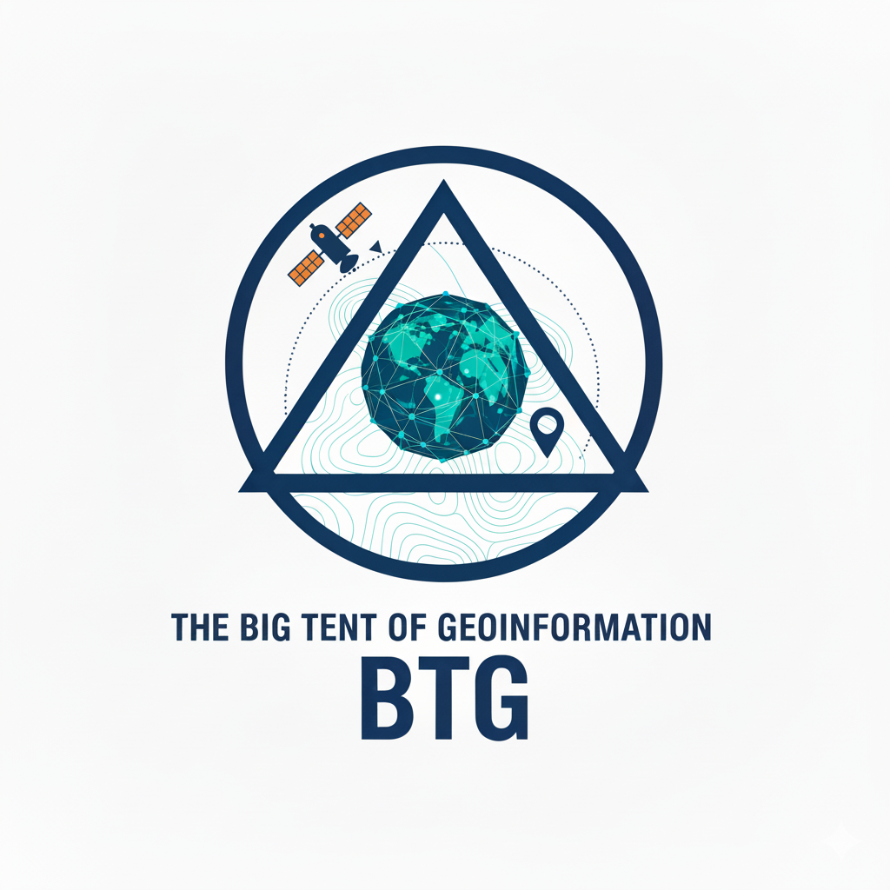

<h3 align="center">
	 
</h3>

## 👋关于我们

大家好！ 我们来自中国地质大学（武汉）地理与信息工程学院！（[学院官网](https://xgxy.cug.edu.cn/)）

测绘与地理信息技术作为现代社会的技术基石，为人类拓宽了感知地球的视角，增强了与环境互动的能力。但不可避免的，作为高新技术，它们都建立在近百年以来工业与信息革命的成果之上，其基础理论深刻，其工程实现复杂。所以，我们发起了Open3S计划。希望能够从这个计划出发，为测绘与地理信息相关专业的同学提供一个分享、交流与成长的平台！

### 🛠️我们的项目
！*Uptate：2025-10-20*

- [CUG-地信飞跃手册(旧-暂时停止更新)](https://cuggers-with-gis.feishu.cn/wiki/IqQSwtWNQiPHG1kuGV0cfN3Nn3c)：一套 Open（开放）-Acessible（可获取）-Pratical（实用）的测绘与地理信息专业学业指南手册。涵盖课内学习、科研实践、技术提升、升学经验等部分。
- [CUG-小信鸽成长学习成长指南(新)](https://365.kdocs.cn/l/cstfXFbS5OML):地信飞跃手册的校内版，目前团队正在优先更新这一指南，并重新设计面向全体年轻学习者社群的飞跃手册。如校外同学也想访问，可以附上个人信息申请，校内账号可以直接访问。
- [CUG-Open3S资料库](https://wpsplus.com/join/gluqsao?invtoken=aGFvbG9uZy1QQzIwMjI=): 地信学院的学业资料库，包含课程课件、实习材料、参考书等，需要校内账号访问（暂不对校外开放）。

- [Awesome-RSEDU](https://github.com/geoinformation-wuhan/awesome-rsedu)：我们整理的遥感科学与技术相关的公开学习资源

### 📖欢迎参与
我们非常欢迎大家加入我们的校内社群：CUG测绘地理大帐篷
<h3 align="center">
	 
</h3>

如果你有可供分享的资料，可以直接上传至地大WPS网盘；如果对项目有疑问，可以通过创建 Issue 的方式提出。

### 🙋‍♀️加入我们

如果你是中国地质大学（武汉）的老师、同学并且有兴趣为计划贡献力量，请大胆联系我们！

- 团队临时邮箱：2643136544@qq.com

我们计划在运营一段时间后将项目扩展到其他院校，如果你也是测绘与地理信息相关专业的本科或研究生（包含但不限于测绘科学与技术、地理学、遥感科学与技术等一级学科），而且对我们的倡议也有兴趣，也欢迎email我们！

### ❤️感谢名单

由衷感谢每一位 CUG-Open3S计划 的参与者:

感谢中国地质大学（武汉）[城市之光Urbancamp课题组](https://www.urbancomp.net/)对本项目的大力支持！

